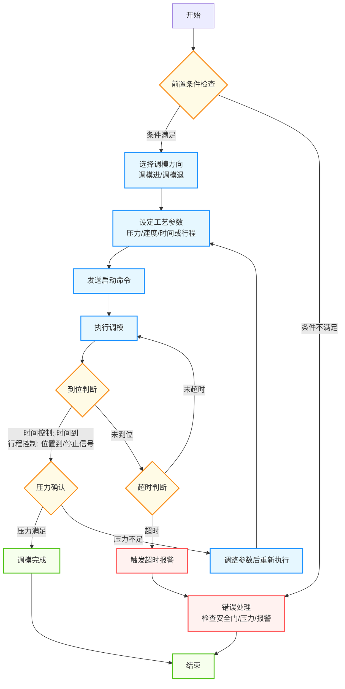
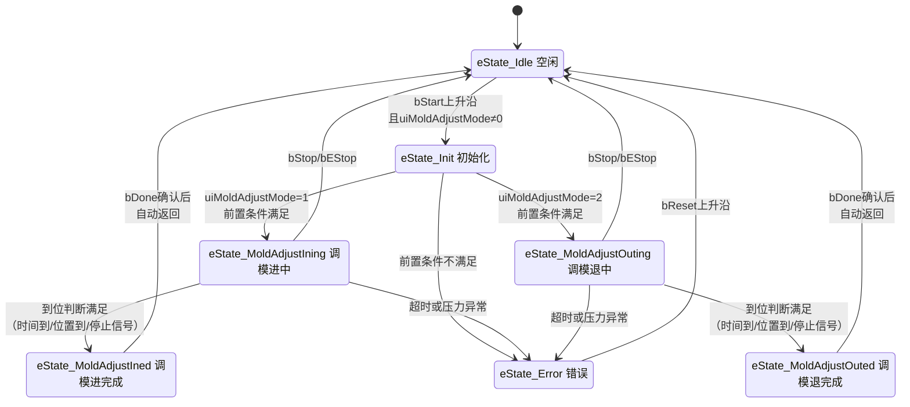
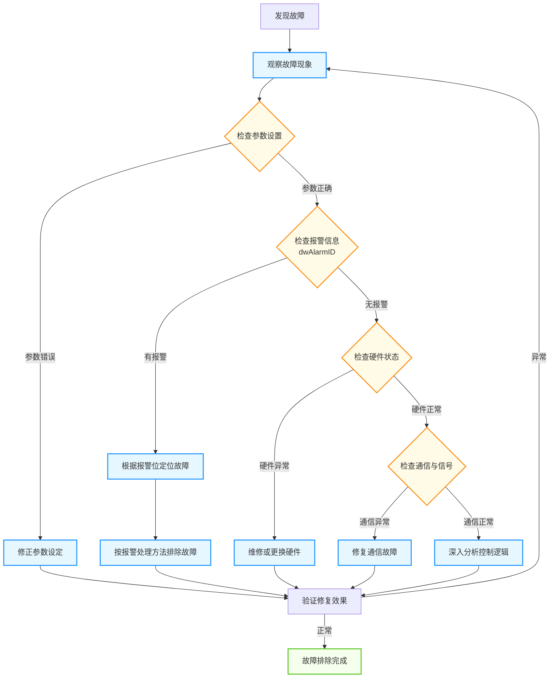

# 注塑机调模功能整理文档

## 1. 功能概述

调模功能是注塑机的核心功能之一，用于调整模具的闭合距离和锁模力，以适应不同规格模具的安装和生产需求。

**核心目标**：

- 确保模具闭合紧密，避免产品出现飞边、毛刺等缺陷
- 防止模具和设备因锁模力不当而受到损坏
- 支持快速换模，提高生产效率

**适用范围**：立式注塑机调模功能开发项目

**文档目的**：为开发人员提供调模功能的完整技术参考，包括功能定义、控制流程、数据结构、参数说明及故障排除指南。

## 2. 功能模式与控制方式

### 2.1 调模方向

调模操作按方向分为两种，通过功能块输入`uiMoldAdjustMode`选择：

| 方向 | 模式值 | 说明 | 典型场景 |
| ---- | ------ | ---- | -------- |
| 调模进 | 1 | 减小模具闭合距离，增加锁模力 | 模具厚度较小，需增大锁模力 |
| 调模退 | 2 | 增大模具闭合距离，减小锁模力 | 模具厚度较大，需减小锁模力 |

> **注意**：`uiMoldAdjustMode = 0`表示无模式，功能块处于空闲状态。

### 2.2 控制方式

调模进和调模退各自独立选择控制方式，通过参数`uiMoldAdjustInMode` / `uiMoldAdjustOutMode`设定：

| 控制方式 | 设定值 | 说明 | 到位判断依据 |
| -------- | ------ | ---- | ------------ |
| 时间控制 | 0 | 按设定时间运行调模电机 | 运行时间达到`uiTime`设定值 |
| 行程控制 | 1 | 按设定行程运行调模电机 | 位置达到目标位置或收到停止信号 |

**时间控制模式**：调模电机按设定的压力和速度运行，运行时间达到设定值后自动停止。适用于不需要精确定位的粗调场景。

**行程控制模式**：调模电机按设定的压力和速度运行，通过位置反馈或停止信号判断到位。适用于需要精确定位的场景。

### 2.3 操作模式

根据操作方式，调模可分为以下操作模式：

| 操作模式 | 说明 | 适用场景 |
| -------- | ---- | -------- |
| 手动调模 | 通过操作面板点动控制调模电机前进/后退 | 模具安装后的精细调整、首次调模 |
| 自动调模 | 设定参数后自动完成调模过程 | 批量生产中的快速换模 |
| 电子尺调模 | 利用电子尺反馈实现精确定位调模 | 对定位精度要求较高的生产 |

> **说明**：操作模式由上位机HMI界面控制，功能块层面通过`bStart`/`bStop`命令和参数设定实现不同操作模式的逻辑。

## 3. 操作流程

### 3.1 前置条件

启动调模前，必须确认以下条件已满足：

| 序号 | 条件 | 说明 |
| ---- | ---- | ---- |
| 1 | 安全门关闭 | 确保操作人员安全 |
| 2 | 系统压力正常 | 液压系统压力在额定范围内 |
| 3 | 模具安装正确 | 模具平行度和垂直度符合要求 |
| 4 | 无报警状态 | 功能块未处于错误状态 |
| 5 | 调模参数已设定 | 位置、速度、压力等参数已正确配置 |

### 3.2 调模流程图



### 3.3 操作步骤详解

**手动调模操作步骤**：

1. 确认前置条件已满足
2. 在操作面板选择调模方向（调模进/调模退）
3. 设定调模压力和速度参数
4. 按住调模按钮，调模电机按设定参数运行
5. 松开按钮，调模电机减速停止
6. 观察位置反馈，确认调模位置是否满足要求
7. 如需继续调整，重复步骤4-6

**自动调模操作步骤**：

1. 确认前置条件已满足
2. 选择调模方向（调模进/调模退）
3. 设定完整的工艺参数（压力、速度、时间/行程、斜率等）
4. 选择控制方式（时间控制/行程控制）
5. 发送启动命令，功能块自动执行调模过程
6. 等待功能块输出完成信号（`bDone = TRUE`）
7. 确认锁模力是否满足要求，必要时调整参数重新执行

**停止操作**：

| 停止类型 | 触发方式 | 行为 | 适用场景 |
| -------- | -------- | ---- | -------- |
| 正常停止 | `bStop = TRUE` | 减速停止 | 正常操作中的停止需求 |
| 急停 | `bEStop = TRUE` | 立即停止，无减速 | 紧急情况下的安全停止 |
| 复位 | `bReset = TRUE` | 从错误状态恢复 | 报警后的复位操作 |

## 4. 状态机设计

### 4.1 状态定义

调模功能采用状态机控制，状态枚举`E_MoldAdjustState`定义如下：

| 状态值 | 状态名称 | 说明 |
| ------ | -------- | ---- |
| 0 | eState_Idle | 空闲状态，等待调模命令 |
| 1 | eState_Init | 初始化状态，进行调模前准备检查 |
| 2 | eState_MoldAdjustIning | 调模进执行中，调模电机按调模进参数运行 |
| 3 | eState_MoldAdjustIned | 调模进完成，调模进动作已结束 |
| 4 | eState_MoldAdjustOuting | 调模退执行中，调模电机按调模退参数运行 |
| 5 | eState_MoldAdjustOuted | 调模退完成，调模退动作已结束 |
| 6 | eState_Error | 错误状态，调模过程中发生异常 |

### 4.2 状态转换图



### 4.3 状态转换条件说明

| 源状态 | 目标状态 | 转换条件 | 说明 |
| ------ | -------- | -------- | ---- |
| Idle | Init | `bStart`上升沿且`uiMoldAdjustMode ≠ 0` | 启动命令触发，进入初始化检查 |
| Init | MoldAdjustIning | `uiMoldAdjustMode = 1`且前置条件满足 | 初始化通过，开始调模进 |
| Init | MoldAdjustOuting | `uiMoldAdjustMode = 2`且前置条件满足 | 初始化通过，开始调模退 |
| Init | Error | 前置条件不满足 | 初始化检查失败，进入错误状态 |
| MoldAdjustIning | MoldAdjustIned | 到位判断满足 | 调模进执行完成 |
| MoldAdjustIning | Error | 超时或压力异常 | 执行过程中发生异常 |
| MoldAdjustIning | Idle | `bStop`或`bEStop` | 操作人员手动停止 |
| MoldAdjustOuting | MoldAdjustOuted | 到位判断满足 | 调模退执行完成 |
| MoldAdjustOuting | Error | 超时或压力异常 | 执行过程中发生异常 |
| MoldAdjustOuting | Idle | `bStop`或`bEStop` | 操作人员手动停止 |
| MoldAdjustIned | Idle | 完成信号确认后自动返回 | 输出`bDone`后返回空闲 |
| MoldAdjustOuted | Idle | 完成信号确认后自动返回 | 输出`bDone`后返回空闲 |
| Error | Idle | `bReset`上升沿 | 报警复位后返回空闲 |

## 5. 数据结构定义

### 5.1 状态枚举 E_MoldAdjustState

```
TYPE E_MoldAdjustState :
(
    eState_Idle,               // 空闲状态
    eState_Init,               // 初始化
    eState_MoldAdjustIning,    // 调模进中
    eState_MoldAdjustIned,     // 调模进完成
    eState_MoldAdjustOuting,   // 调模退中
    eState_MoldAdjustOuted,    // 调模退完成
    eState_Error               // 错误状态
);
END_TYPE
```

### 5.2 单段工艺参数 ST_MoldAdjustSeg

定义单段调模过程的基本工艺参数：

| 参数名称 | 类型 | 说明 |
| -------- | ---- | ---- |
| uiPres | UINT | 设定压力 |
| uiSpd | UINT | 设定速度 |
| uiTime | UINT | 设定时间（时间控制模式下的运行时长） |

### 5.3 调模工艺参数 ST_MoldAdjustPara

定义调模进和调模退的完整工艺参数，包含控制方式、段参数和加减速斜率：

**调模进工艺参数**：

| 参数名称 | 类型 | 说明 |
| -------- | ---- | ---- |
| uiMoldAdjustInMode | UINT | 调模进控制方式：0-时间控制，1-行程控制 |
| uiMoldAdjustInLimitTime | UINT | 调模进限制时间（超时保护） |
| stMoldAdjustInSeg | ST_MoldAdjustSeg | 调模进段参数（压力/速度/时间） |
| uiMoldAdjustInPresStartGrad | UINT | 压力启动斜率 |
| uiMoldAdjustInPresStopGrad | UINT | 压力停止斜率 |
| uiMoldAdjustInSpdStartGrad | UINT | 速度启动斜率 |
| uiMoldAdjustInSpdStopGrad | UINT | 速度停止斜率 |

**调模退工艺参数**：

| 参数名称 | 类型 | 说明 |
| -------- | ---- | ---- |
| uiMoldAdjustOutMode | UINT | 调模退控制方式：0-时间控制，1-行程控制 |
| uiMoldAdjustOutLimitTime | UINT | 调模退限制时间（超时保护） |
| stMoldAdjustOutSeg | ST_MoldAdjustSeg | 调模退段参数（压力/速度/时间） |
| uiMoldAdjustOutPresStartGrad | UINT | 压力启动斜率 |
| uiMoldAdjustOutPresStopGrad | UINT | 压力停止斜率 |
| uiMoldAdjustOutSpdStartGrad | UINT | 速度启动斜率 |
| uiMoldAdjustOutSpdStopGrad | UINT | 速度停止斜率 |

> **斜率参数说明**：启动斜率控制压力/速度从零上升到设定值的过渡时间，停止斜率控制从设定值下降到零的过渡时间。斜率值越大，过渡越平缓，有助于减少机械冲击。

## 6. 功能块接口定义

功能块`FB_MoldAdjust`是调模功能的核心实现，封装了状态机逻辑、参数处理和输出控制。

### 6.1 输入输出接口

**轴引用**：

| 接口类型 | 参数名称 | 类型 | 说明 |
| -------- | -------- | ---- | ---- |
| VAR_IN_OUT | stMoldAdjustAxis | ST_AxisRefHyd | 调模液压轴引用 |

**控制命令**：

| 接口类型 | 参数名称 | 类型 | 说明 |
| -------- | -------- | ---- | ---- |
| VAR_INPUT | bStart | BOOL | 启动命令（上升沿触发） |
| VAR_INPUT | bStop | BOOL | 停止命令（减速停止） |
| VAR_INPUT | bEStop | BOOL | 急停命令（立即停止，无减速） |
| VAR_INPUT | bReset | BOOL | 复位命令（上升沿触发，从错误状态恢复） |

**模式与参数**：

| 接口类型 | 参数名称 | 类型 | 说明 |
| -------- | -------- | ---- | ---- |
| VAR_INPUT | uiMoldAdjustMode | UINT | 方向选择：0-无模式，1-调模进，2-调模退 |
| VAR_INPUT | stMoldAdjustPara | ST_MoldAdjustPara | 工艺参数输入 |

**数字信号输入**：

| 接口类型 | 参数名称 | 类型 | 说明 |
| -------- | -------- | ---- | ---- |
| VAR_INPUT | bMoldAdjustInStop | BOOL | 调模进停止信号（行程控制模式下的到位信号） |
| VAR_INPUT | bMoldAdjustOutStop | BOOL | 调模退停止信号（行程控制模式下的到位信号） |

**模拟信号输入**：

| 接口类型 | 参数名称 | 类型 | 说明 |
| -------- | -------- | ---- | ---- |
| VAR_INPUT | uiClampPresElecRulerVal | UINT | 锁模压力电子尺值（用于压力监控） |

### 6.2 状态输出

| 接口类型 | 参数名称 | 类型 | 说明 |
| -------- | -------- | ---- | ---- |
| VAR_OUTPUT | bBusy | BOOL | 忙状态（功能块正在执行调模动作） |
| VAR_OUTPUT | bDone | BOOL | 完成状态（调模动作执行完成） |
| VAR_OUTPUT | bAlarm | BOOL | 报警状态（功能块检测到异常） |

### 6.3 报警信息输出

| 接口类型 | 参数名称 | 类型 | 说明 |
| -------- | -------- | ---- | ---- |
| VAR_OUTPUT | dwAlarmID | DWORD | 报警代码（按位标识，支持同时报告多个报警） |

**报警位定义**：

| 位 | 位掩码 | 报警名称 | 说明 |
| -- | ------ | -------- | ---- |
| - | 0x00000000 | 无报警 | 正常状态 |
| Bit0 | 0x00000001 | 调模进超时 | 调模进运行时间超过限制时间 |
| Bit1 | 0x00000002 | 调模退超时 | 调模退运行时间超过限制时间 |
| Bit2 | 0x00000004 | 调模压力异常 | 调模过程中检测到压力异常 |

> **位标识说明**：`dwAlarmID`采用DWORD按位标识方式，每个位对应一种报警类型。当多个报警同时发生时，对应位同时置位。例如`dwAlarmID = 0x00000005`表示同时存在调模进超时和调模压力异常。

### 6.4 动作提示输出

| 接口类型 | 参数名称 | 类型 | 说明 |
| -------- | -------- | ---- | ---- |
| VAR_OUTPUT | uiActHint | UINT | 当前动作状态编码 |
| VAR_OUTPUT | uiActTime | UINT | 当前动作运行时间（单位：0.1s） |

**uiActHint 编码规则**：采用十位/个位组合编码，十位表示操作类型，个位表示子状态。

| 编码值 | 十位含义 | 个位含义 | 说明 |
| ------ | -------- | -------- | ---- |
| 0 | - | 无动作 | 空闲状态 |
| 1 | - | 报警状态 | 错误状态 |
| 2 | - | 调模进完成 | 调模进到位 |
| 3 | - | 调模退完成 | 调模退到位 |
| 11 | 1-调模进 | 1-执行中 | 调模进运行中 |
| 21 | 2-调模退 | 1-执行中 | 调模退运行中 |

> **扩展说明**：编码规则预留了扩展空间，十位1x系列用于调模进子状态，2x系列用于调模退子状态，个位0-3可分别表示不同子阶段。

### 6.5 动作状态输出

| 接口类型 | 参数名称 | 类型 | 说明 |
| -------- | -------- | ---- | ---- |
| VAR_OUTPUT | bMoldAdjustIned | BOOL | 调模进完成标志 |
| VAR_OUTPUT | bMoldAdjustOuted | BOOL | 调模退完成标志 |

### 6.6 控制命令输出

| 接口类型 | 参数名称 | 类型 | 说明 |
| -------- | -------- | ---- | ---- |
| VAR_OUTPUT | uiPresCmd | UINT | 压力命令输出（发送至液压比例阀） |
| VAR_OUTPUT | uiSpdCmd | UINT | 速度命令输出（发送至液压比例阀） |
| VAR_OUTPUT | udiPosCmd | UDINT | 位置命令输出（发送至位置控制器） |

## 7. 参数说明与调整指南

### 7.1 位置参数

| 参数 | 说明 | 设定建议 | 调整原则 |
| ---- | ---- | -------- | -------- |
| 调模位置设定 | 目标调模位置 | 根据模具实际厚度设定 | 新模具首次使用应预留安全距离，避免压坏模具 |
| 调模前限 | 调模前进最大位置限制 | 设定为设备机械极限的90% | 不得超过机械极限，防止设备损坏 |
| 调模后限 | 调模后退最大位置限制 | 设定为设备机械极限的90% | 不得超过机械极限，防止设备损坏 |
| 调模原点位置 | 调模基准位置 | 设备安装时设定，定期校准 | 定期校准确保定位精度，建议每季度校准一次 |

### 7.2 速度参数

| 参数 | 说明 | 设定建议 | 调整原则 |
| ---- | ---- | -------- | -------- |
| 调模快速速度 | 快速运行速度 | 大型模具：10-15mm/s；小型模具：15-20mm/s | 大型模具应使用较慢速度，避免惯性冲击 |
| 调模慢速速度 | 接近目标位置时的速度 | 5-10mm/s | 接近目标位置时切换为慢速，提高定位精度 |
| 调模精确定位速度 | 最终定位速度 | 1-3mm/s | 确保定位精度，减少位置偏差 |

**速度斜率设定**：

| 参数 | 说明 | 设定建议 |
| ---- | ---- | -------- |
| 速度启动斜率 | 速度从零上升到设定值的过渡速率 | 较大值使启动更平缓，减少机械冲击 |
| 速度停止斜率 | 速度从设定值下降到零的过渡速率 | 较大值使停止更平缓，避免位置过冲 |

### 7.3 压力参数

| 参数 | 说明 | 设定建议 | 调整原则 |
| ---- | ---- | -------- | -------- |
| 调模压力设定 | 调模过程系统压力 | 系统额定压力的50-70% | 压力应足够但不宜过高，避免设备过载和能源浪费 |
| 调模低压压力 | 低压调模时压力 | 系统额定压力的30-50% | 用于模具保护，防止模具受损 |

**压力斜率设定**：

| 参数 | 说明 | 设定建议 |
| ---- | ---- | -------- |
| 压力启动斜率 | 压力从零上升到设定值的过渡速率 | 较大值使压力建立更平缓 |
| 压力停止斜率 | 压力从设定值下降到零的过渡速率 | 较大值使压力释放更平缓 |

### 7.4 时间参数

| 参数 | 说明 | 设定建议 | 调整原则 |
| ---- | ---- | -------- | -------- |
| 调模限时 | 单次调模操作最大允许时间 | 30-60秒，根据设备规格调整 | 超时将触发报警，设定值应留有合理裕量 |
| 调模定位时间 | 调模完成后定位保持时间 | 2-5秒 | 确保位置稳定后再进入下一工序 |

### 7.5 精度控制要点

1. **最终定位使用慢速**：接近目标位置时切换为慢速或精确定位速度，确保定位精度
2. **利用电子尺反馈**：实时监控调模位置，实现闭环控制，提高控制精度
3. **定期校准**：定期校准电子尺和机械限位，确保测量准确性
4. **生产前检查**：重要产品生产前对调模精度进行检查和确认
5. **参数记录**：记录不同模具的调模参数，便于下次使用时快速调用

## 8. 报警与状态指示

### 8.1 报警处理

当功能块检测到异常时，`bAlarm`置位，`dwAlarmID`按位标识报警类型：

| 报警位 | 位掩码 | 报警名称 | 触发条件 | 处理方法 |
| ------ | ------ | -------- | -------- | -------- |
| Bit0 | 0x00000001 | 调模进超时 | 调模进运行时间超过`uiMoldAdjustInLimitTime` | 检查目标位置设置、机械状态和负载情况 |
| Bit1 | 0x00000002 | 调模退超时 | 调模退运行时间超过`uiMoldAdjustOutLimitTime` | 检查目标位置设置、机械状态和负载情况 |
| Bit2 | 0x00000004 | 调模压力异常 | 调模过程中检测到压力超出正常范围 | 检查压力参数、液压系统和传感器 |

**报警处理流程**：

1. 功能块进入`eState_Error`状态，`bAlarm = TRUE`
2. `dwAlarmID`按位置位，标识具体报警类型
3. `uiActHint = 1`，指示当前为报警状态
4. 调模电机停止运行
5. 操作人员排查故障原因
6. 故障排除后，发送`bReset`上升沿命令
7. 功能块返回`eState_Idle`，报警状态清除

### 8.2 动作状态指示

`uiActHint`提供当前动作状态的实时指示，便于HMI界面显示和监控：

| 编码值 | 说明 | 对应状态 |
| ------ | ---- | -------- |
| 0 | 无动作 | eState_Idle |
| 1 | 报警状态 | eState_Error |
| 2 | 调模进完成 | eState_MoldAdjustIned |
| 3 | 调模退完成 | eState_MoldAdjustOuted |
| 11 | 调模进中 | eState_MoldAdjustIning |
| 21 | 调模退中 | eState_MoldAdjustOuting |

## 9. 故障排除

### 9.1 常见故障及解决方法

| 故障现象 | 可能原因 | 排查步骤 | 解决方法 |
| -------- | -------- | -------- | -------- |
| 调模无动作 | 电源故障、电机故障、控制线路故障 | 1.检查电源供电 2.检查电机接线 3.检查控制线路 | 修复电源/电机/线路故障 |
| 调模速度异常 | 速度参数设置错误、电机故障、负载过大 | 1.检查速度参数设定 2.检查电机运行状态 3.检查机械负载 | 修正参数/更换电机/减小负载 |
| 调模位置偏差大 | 电子尺校准错误、机械间隙过大、参数设置错误 | 1.校准电子尺 2.检查机械间隙 3.检查位置参数 | 重新校准/调整间隙/修正参数 |
| 调模压力异常 | 压力参数设置错误、液压系统故障、传感器故障 | 1.检查压力参数 2.检查液压系统 3.检查压力传感器 | 修正参数/维修液压系统/更换传感器 |
| 调模超时报警 | 目标位置设置错误、机械卡滞、负载过大 | 1.检查目标位置 2.检查机械运动 3.检查负载情况 | 修正位置/排除卡滞/减小负载 |
| 调模噪音大 | 机械润滑不足、部件磨损、安装松动 | 1.检查润滑状态 2.检查部件磨损 3.检查紧固件 | 加强润滑/更换部件/紧固松动件 |

### 9.2 故障诊断流程



## 10. 安全注意事项

### 10.1 安全要求

| 序号 | 安全要求 | 说明 |
| ---- | -------- | ---- |
| 1 | 调模前确认安全门关闭 | 安全门未关闭时禁止启动调模 |
| 2 | 避免过载操作 | 调模压力不得超过设备额定值 |
| 3 | 紧急停止功能可用 | 确保急停按钮功能正常，发生异常时立即按下 |
| 4 | 参数上下限保护 | 关键参数应设置合理的上下限，防止误操作 |
| 5 | 定期维护检查 | 定期检查调模机构的机械部件和传感器 |

### 10.2 操作规范

| 序号 | 操作规范 | 说明 |
| ---- | -------- | ---- |
| 1 | 模具安装确认 | 模具安装应正确，确保平行度和垂直度 |
| 2 | 参数合理设定 | 根据模具规格合理设定调模参数，避免盲目操作 |
| 3 | 渐进调整原则 | 调模过程应循序渐进，避免一次性调整过大 |
| 4 | 观察运行反馈 | 调模过程中密切观察设备反馈，及时发现异常 |
| 5 | 参数记录保存 | 重要模具的调模参数应记录保存，便于下次使用 |
| 6 | 定期清洁维护 | 定期清洁调模机构，防止灰尘和杂物影响精度 |
| 7 | 人员培训要求 | 操作人员应经过培训，熟悉调模操作流程和安全注意事项 |

## 11. 相关文档与版本信息

### 11.1 技术文档

- [调模定义.st](./ST定义/调模定义.st)：调模功能的ST语言定义文件，包含状态机、工艺参数结构体和功能块接口定义
- [数据定义初版.st](./ST定义/数据定义初版.st)：锁模控制数据定义，包含开合模功能块定义

### 11.2 参考标准

- GB/T 12783-2000 《塑料注射成型机》
- GB 22530-2008 《塑料注射成型机安全要求》
- ISO 20430:2018 《Plastics and rubber machines - Injection moulding machines - Safety requirements》

### 11.3 版本控制

| 版本 | 日期 | 作者 | 变更说明 |
| ---- | ---- | ---- | -------- |
| 1.0 | 2025-08-17 | 汪工 | 初始版本，完成基本功能描述 |
| 1.1 | 2025-10-09 | 汪工 | 完善功能描述，添加详细参数说明 |
| 1.2 | 2026-03-17 | 周工/汪工 | 调整文档结构，优化内容组织；更新数据结构定义，确保与代码一致性；优化文档格式，添加页内导航支持 |
| 1.3 | 2026-03-23 | 周工/汪工 | 简化变量名称，添加提示信息，提高代码可读性和一致性；优化Mermaid图表样式 |
| 1.4 | 2026-04-02 | 周工/汪工 | dwAlarmID改为DWORD按位标识，支持同时报告多个报警 |
| 1.5 | 2026-04-09 | 周工/汪工 | 补充ST定义中的状态机、工艺参数结构体和功能块接口详细说明到文档中 |
| 2.0 | 2026-04-09 | 周工/汪工 | 全面梳理文档结构：重新组织章节逻辑；补充控制方式说明、前置条件和状态转换图；修正报警代码为位标识定义；整合参数说明与调整指南；添加故障诊断流程图 |
